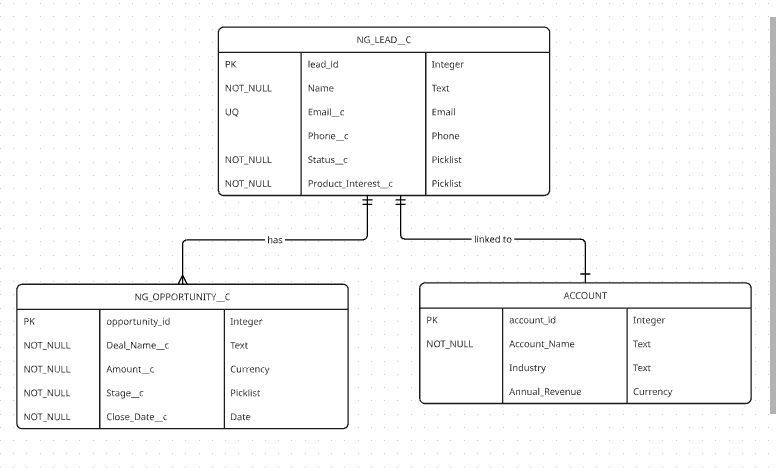

# Business Solution: Addressing Lead Leakage at NextGen Electronics

## Introduction

This document outlines the comprehensive approach to solving the critical business problem of "lead leakage" at NextGen Electronics. By presenting a structured, phased methodology, we ensure that our solution is not only technically sound but also aligned with business needs, making it easy for stakeholders, developers, and future maintainers to understand the rationale and implementation.

### The Core Problem: Lead Leakage

Lead leakage occurs when potential customers—individuals or organizations expressing interest in NextGen Electronics' products—are not properly captured, tracked, or converted into sales opportunities. This results in lost revenue, inefficient sales processes, and a lack of visibility into marketing effectiveness.

#### Detailed Impact Analysis

1. **Revenue Loss**: Without a centralized system, leads are scattered across spreadsheets, emails, and personal notes. Many leads fall through the cracks, never reaching the sales team. For a company like NextGen Electronics, which relies on timely conversions in the fast-paced consumer electronics market, this can mean missing out on thousands of dollars in potential sales. For example, if 20% of leads are lost due to poor tracking, and the average deal size is $500, losing 100 leads per month equates to $10,000 in missed revenue.

2. **Data Quality Issues**: Manual tracking leads to inconsistent and inaccurate data. Email addresses might be misspelled, phone numbers incomplete, or contact information duplicated. This "garbage in, garbage out" scenario wastes sales agents' time on unqualified or unreachable leads, reducing productivity and morale. In a survey by Salesforce, 79% of marketing leads never convert to sales, often due to poor data quality.

3. **Lack of Process Visibility**: Sales managers cannot forecast accurately or identify which marketing channels are most effective. Without clear metrics on lead-to-opportunity conversion rates, it's impossible to optimize strategies. This opacity hinders strategic decision-making and prevents the company from scaling effectively.

4. **Operational Inefficiencies**: Sales agents spend excessive time searching for lead information or reconciling data from multiple sources. This manual effort detracts from core selling activities, such as building relationships and closing deals. Additionally, without standardized processes, there's no way to ensure compliance with best practices or regulatory requirements (e.g., data privacy laws).

5. **Competitive Disadvantage**: In the competitive electronics market, companies that can quickly respond to leads and provide personalized experiences win. Lead leakage puts NextGen Electronics at a disadvantage, allowing competitors to capture market share. Moreover, as the company grows, the problem exacerbates—more leads mean more potential for loss without a robust system.

By addressing lead leakage, we aim to create a single source of truth for lead data, enforce data integrity, and establish a clear, repeatable process for converting interest into revenue. This foundation will support long-term growth, improve customer satisfaction, and enable data-driven decision-making.

## Phase 1: Requirements Elicitation & User Stories

**Role: Business Analyst**  
**Goal: Translate "Lead Leakage" into actionable requirements.**

In this phase, we conducted thorough stakeholder interviews, analyzed existing processes, and documented user stories to ensure our solution meets real-world needs. The focus was on understanding pain points and defining success criteria.

### Expanded Problem Statement

NextGen Electronics currently relies on disparate tools for lead management, leading to fragmentation and loss. Sales agents use spreadsheets for initial capture, emails for follow-ups, and CRM notes for updates—creating silos that prevent collaboration. Validation is nonexistent, allowing bad data to proliferate, and there's no automated linkage between leads and opportunities, forcing manual reconciliation that is error-prone and time-consuming.

### User Stories (The "Why")

These user stories capture the perspectives of key personas, ensuring our solution delivers value across the organization:

- **As a Sales Agent**, I want to record potential customers with mandatory contact information so that I don't waste time on bad data.  
  *Acceptance Criteria:* Email and phone fields are required; system prevents saving incomplete records. Duplicate detection alerts me to potential matches.

- **As a Sales Manager**, I want to convert a qualified lead into a deal so I can track the revenue pipeline.  
  *Acceptance Criteria:* One-click conversion creates an opportunity linked to the lead; status updates automatically; pipeline reports are available in real-time.

- **As the IT Director**, I want to ensure duplicate emails are flagged so our database remains clean.  
  *Acceptance Criteria:* Unique email constraint enforced; duplicate detection runs on create/edit; merge functionality available for resolving duplicates.

Additional user stories identified:
- **As a Marketing Manager**, I want to see which campaigns generate the most qualified leads so I can optimize spend.  
- **As a CEO**, I want accurate forecasting based on lead conversion rates so I can make informed strategic decisions.

## Phase 2: Business Process Mapping

**Role: Process Architect**  
**Goal: Define the "Happy Path" for the data.**

This phase involved mapping the end-to-end lead lifecycle, identifying bottlenecks, and designing a streamlined process. We used BPMN notation to visualize the flow, ensuring clarity for implementation.

### The Flow: Lead-to-Revenue Conversion

The "Happy Path" represents the ideal journey from initial interest to closed deal, minimizing exceptions and maximizing efficiency.

1. **Capture: Lead Created (Status: New)**  
   - Trigger: Marketing form submission, website inquiry, or manual entry by sales agent.  
   - Actions: Validate required fields (email, phone); check for duplicates; assign to appropriate sales agent based on product interest or geography.  
   - Outcome: Lead record created with status "New," notification sent to assigned agent.

2. **Qualify: Agent Contacts Lead (Status: Working)**  
   - Process: Agent reviews lead details, initiates contact (email, phone, demo).  
   - Actions: Update status to "Working"; log interaction notes; schedule follow-ups.  
   - Decision Point: If lead shows interest, proceed to conversion; if not, mark as "Dead" or nurture further.

3. **Convert: Lead is Interested**  
   - Trigger: Agent determines lead is qualified (e.g., budget confirmed, timeline set).  
   - Actions:  
     - Create "Opportunity" record linked to the lead.  
     - Populate opportunity with deal details (name, amount, close date).  
     - Update lead status to "Converted."  
   - Outcome: Seamless transition from prospecting to selling, with full audit trail.

### Process Considerations

- **Exception Handling**: For unqualified leads, status set to "Dead" with reason (e.g., budget too low).  
- **Automation**: Email alerts for status changes; reminders for follow-ups.  
- **Metrics**: Track conversion rates at each stage to identify improvements.  
- **Scalability**: Process designed to handle high volumes without manual intervention.

## Phase 3: Data Modeling (ERD & Schema)

**Role: Data Architect**  
**Goal: Design the database structure before clicking any buttons.**

A robust data model ensures data integrity, performance, and extensibility. We prioritized standard Salesforce objects where possible but introduced custom objects for specific needs.

### Entity-Relationship Diagram (ERD) Overview

- Leads are the central entity, linked to opportunities for potential deals.  
- Integration with standard Account object for converted customers.

### Detailed Schema

#### 1. Object: NextGen Lead (NG_Lead__c)

**Purpose**: Tracks individual people interested in products. This custom object extends beyond standard Lead to include product-specific fields and enforce uniqueness.

**Key Fields**:
- **Name** (Text, Standard): Full name of the prospect.
- **Email__c** (Email, Required, Unique): Primary contact email; enforced uniqueness prevents duplicates.
- **Phone__c** (Phone): Contact number for follow-ups.
- **Status__c** (Picklist: New, Contacted, Qualified, Converted, Dead): Tracks progression through the sales funnel.
- **Product_Interest__c** (Picklist: TV, Audio, Computing): Categorizes interest for routing and reporting.

**Additional Fields**: CreatedDate, LastModifiedDate, OwnerId (for assignment).

#### 2. Object: NextGen Opportunity (NG_Opportunity__c)

**Purpose**: Tracks the potential revenue deal. This object represents the commercial aspect, separate from the lead for flexibility.

**Key Fields**:
- **Deal_Name__c** (Text): Descriptive name (e.g., "John Doe - TV Purchase").
- **Amount__c** (Currency): Estimated deal value.
- **Stage__c** (Picklist: Discovery, Proposal, Negotiation, Closed Won, Closed Lost): Sales stage for pipeline tracking.
- **Close_Date__c** (Date): Expected close date for forecasting.

**Additional Fields**: Probability__c (for weighted forecasting), NextStep (action items).

#### 3. The Relationship (The "Secret Sauce")

**Type**: Lookup Relationship.  
**Direction**: NG_Opportunity__c looks up to NG_Lead__c.  
**Rationale**: A single lead might generate multiple opportunities over time (e.g., initial TV purchase followed by audio system). This one-to-many relationship allows for historical tracking without data duplication. The lookup ensures referential integrity, preventing orphaned opportunities.

**Implementation Notes**:
- Cascade delete: Prevent deletion of leads with active opportunities.
- Reporting: Enable roll-up summaries for total opportunity value per lead.
- Security: Field-level security to control access based on roles.

## Conclusion

This phased approach transforms the lead leakage problem into a structured, implementable solution. By starting with deep problem understanding and user-centric requirements, we ensure the final system delivers tangible business value. The data model provides a scalable foundation, ready for development and testing.

Next steps include prototyping the custom objects in Salesforce, implementing validation rules, and building the conversion process. This document serves as a blueprint for the development team, ensuring alignment and reducing rework.
